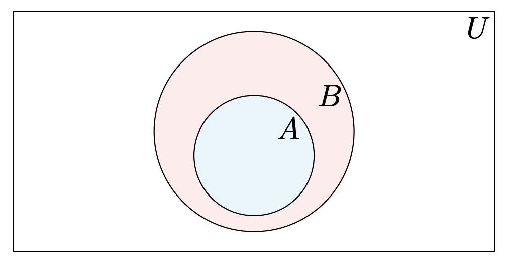

# Tổng Hợp Lý Thuyết Toán Rời Rạc (Phần tập hợp - Set Theory)
## Bài tập 
- [Bài tập về tập hợp cơ bản B1](B1/README.md)
- [Bài tập về tập hợp cơ bản bổ sung tự luyện B1-extra](B1-extra/README.md)
## Định Nghĩa và Đặc Điểm

### Tập hợp (Set)
- **Định nghĩa:** Một tập hợp là một bộ sưu tập không có thứ tự của các đối tượng, gọi là phần tử (elements) của tập hợp đó.
- **Ký hiệu:** Sử dụng chữ cái in hoa để đặt tên cho tập hợp, ví dụ \(A\), \(B\), \(C\),...
- **Cách biểu diễn:** Phần tử của tập hợp được liệt kê trong ngoặc nhọn, ví dụ \(A = \{a, b, c\}\).
- **Phương pháp Roster (Roster Method):** Liệt kê tất cả các phần tử của tập hợp, ví dụ \(V = \{a, e, i, o, u\}\).
- **Phương pháp Builder Notation (Set Builder Notation):** Mô tả các phần tử của tập hợp thông qua tính chất, ví dụ \(O = \{x ∈ ℤ^+ | x là số nguyên lẻ và x < 10\}\).
- **Ví dụ:**
  - \(A = \{1, 2, 3\}\) là tập hợp các số nguyên dương nhỏ hơn 4.
  - \(B = \{x | x ∈ ℤ và 0 < x < 4\}\) là tập hợp các số nguyên dương nhỏ hơn 4.
  - \(C = \{x | x ∈ ℝ và x^2 = 1\}\) là tập hợp các số thực có bình phương bằng 1.

### Tập hợp rỗng (Empty Set)
- **Định nghĩa:** Tập hợp không chứa phần tử nào, ký hiệu là \(∅\).
- **Ví dụ:**
  - \( \{x ∈ ℤ^+ | x > x^2\} = ∅ \) vì không có số nguyên dương nào lớn hơn bình phương của chính nó.
  - \( \{x ∈ ℝ | x^2 = -1\} = ∅ \) vì không có số thực nào có bình phương là số âm.

### Tập hợp con và Tập hợp thực sự (Subset and Proper Subset)
- **Tập hợp con (Subset):** \(A ⊆ B\) nếu mọi phần tử của \(A\) cũng là phần tử của \(B\).
- **Tập hợp thực sự (Proper Subset):** \(A ⊂ B\) nếu \(A\) là tập hợp con của \(B\) và \(A\) không bằng \(B\).
- **Ví dụ:**
  - \(\{1, 2, 3\} ⊆ \{1, 2, 3, 4, 5\}\)
  - \(\{1, 2, 3\} ⊂ \{1, 2, 3, 4, 5\}\)
  - \(ℤ = \{..., -2, -1, 0, 1, 2, ...\}\) là tập hợp các số nguyên.
  - \(ℤ^+ = \{1, 2, 3, ...\}\) là tập hợp các số nguyên dương.
  - \(ℤ^- = \{..., -3, -2, -1\}\) là tập hợp các số nguyên âm.
  - \(ℚ = \{p/q | p, q ∈ ℤ, q ≠ 0\}\) là tập hợp các số hữu tỉ.
  - \(ℝ = \{x | x là số thực\}\) là tập hợp các số thực.
  - \(ℂ = \{a + bi | a, b ∈ ℝ, i^2 = -1\}\) là tập hợp các số phức.
  - \(ℕ = \{0, 1, 2, 3, ...\}\).

  => \(ℕ ⊆ ℤ ⊆ ℚ ⊆ ℝ ⊆ ℂ\)

  ***Chú ý:*** Tập hợp rỗng \(∅\) là tập hợp con của mọi tập hợp nhưng không phải là tập hợp thực sự của bất kỳ tập hợp nào (Nó không thuộc vào bất kỳ tập hợp nào).

  ***Mở rộng :*** Tập hợp con của một tập hợp \(A\) bao gồm chính nó và tập hợp rỗng \(∅\).

### Tích Descartes (Cartesian Product)
- **Định nghĩa:** Tích Descartes của hai tập hợp \(A\) và \(B\) là tập hợp các cặp có thứ tự \((a, b)\), với \(a ∈ A\) và \(b ∈ B\).
- **Ký hiệu:** \(A × B = \{(a, b) | a ∈ A và b ∈ B\}\).
- **Ví dụ:**
  - Nếu \(A = \{1, 2\}\) và \(B = \{a, b\}\), thì \(A × B = \{(1, a), (1, b), (2, a), (2, b)\}\).

### Quan hệ (Relation)
- **Định nghĩa:** Một quan hệ từ tập hợp \(A\) đến \(B\) là một tập hợp con của tích Descartes \(A × B\).
- **Ví dụ:** Nếu \(R\) là một quan hệ từ \(A = \{1, 2, 3\}\) đến \(B = \{a, b, c\}\), một ví dụ về quan hệ có thể là \(R = \{(1, a), (2, b), (3, c)\}\).

### Hợp và Giao của các tập hợp (Union and Intersection)
- **Hợp của các tập hợp:** \(A ∪ B\) là tập hợp chứa tất cả các phần tử của \(A\) và \(B\).
- **Giao của các tập hợp:** \(A ∩ B\) là tập hợp chứa tất cả các phần tử mà \(A\) và \(B\) đều chứa.
- **Ví dụ:**
  - Nếu \(A = \{1, 2, 3\}\) và \(B = \{3, 4, 5\}\), thì:
    - \(A ∪ B = \{1, 2, 3, 4, 5\}\).
    - \(A ∩ B = \{3\}\).

### Phần bù của tập hợp (Complement of a Set)
- **Định nghĩa:** Phần bù của tập hợp \(A\) trong tập hợp \(U\) là tập hợp chứa tất cả các phần tử của \(U\) mà không thuộc \(A\).
- **Ký hiệu:** \(A^c\) hoặc \(A'\).
- **Ví dụ:** Nếu \(U = \{1, 2, 3, 4, 5\}\) và \(A = \{1, 2, 3\}\), thì \(A' = \{4, 5\}\).
- **Tính chất 1:**
  - \(A ∪ A' = U\) (U là tập hợp chứa tất cả các phần tử).
  - \(A ∩ A' = ∅\).
- **Tính chất 2:**
  - \((A ∪ B)' = A' ∩ B'\).
  - \((A ∩ B)' = A' ∪ B'\).
- **Chú ý:** Phần bù của phần bù của một tập hợp bằng chính tập hợp đó, tức là \((A^c)^c = A\).

## Tính Chất Cơ Bản

### Đẳng thức tập hợp (Equal Sets)
- **Định nghĩa:** Hai tập hợp là bằng nhau nếu chúng có cùng các phần tử.
- **Ký hiệu:** \(A = B\) nếu mọi \(x\), \(x ∈ A\) khi và chỉ khi \(x ∈ B\).
- **Ví dụ:** Nếu \(A = \{1, 2, 3\}\) và \(B = \{3, 2, 1\}\), thì \(A = B\).
- **Chú ý 1:** Thứ tự của các phần tử không quan trọng.
- **Chú ý 2:** Số lượng lần xuất hiện của mỗi phần tử không quan trọng.
- **Ví dụ:** Nếu ta có \(A = \{1, 2, 2, 3, 3, 3\}\) và \(B = \{1, 2, 3\}\), thì \(A = B\).

### Axiom of Extension (Tiên đề mở rộng)
- **Định nghĩa:** Một tập hợp được xác định bởi các phần tử của nó. Thứ tự các phần tử không quan trọng và mỗi phần tử chỉ được liệt kê một lần.

### Đồ thị Venn (Venn Diagrams)
- **Sử dụng:** Đồ thị Venn được sử dụng để biểu diễn các mối quan hệ giữa các tập hợp.
- **Ví dụ:** Vẽ đồ thị Venn cho tập hợp A là tập con của tập hợp B. Cả A và B đều nằm trong Universe U (Không gian mẫu).
 

## Công Thức và Tính Chất Nâng Cao

### Tập hợp các tập con (Power Set)
- **Định nghĩa:** Tuple là một dãy hữu hạn các phần tử, có thể là các số, chữ cái, hoặc các đối tượng khác. Tập hợp này có thứ tự, nghĩa là \((a, b) ≠ (b, a)\) nếu \(a ≠ b\). n-tuple là một tuple có n phần tử.
- **Ví dụ:** \((1, 2, 3)\) là một 3-tuple, \((a, b)\) là một 2-tuple (hay còn gọi là pair).
- **Định nghĩa:** Tập hợp các tập con của một tập hợp \(S\) bao gồm tất cả các tập con của \(S\).
- **Ký hiệu:** \(P(S)\), ví dụ nếu \(S = \{1, 2, 3\}\) thì \(P(S) = \{∅, \{1\}, \{2\}, \{3\}, \{1, 2\}, \{1, 3\}, \{2, 3\}, \{1, 2, 3\}\)\.

### Kích thước của tập hợp (Cardinality)
- **Định nghĩa:** Số lượng phần tử trong một tập hợp, ký hiệu là \(|S|\).
- **Ví dụ:** Nếu \(S = \{1, 2, 3\}\), thì \(|S| = 3\).
- **Tính chất:**
  - \(|P(S)| = 2^{|S|}\).
**Ví dụ:** Nếu \(S = \{1, 2, 3\}\), thì \(|P(S)| = 2^3 = 8\).

### Định lý De Morgan

- **Định lý:** Cho hai tập hợp \(A\) và \(B\), thì:
  - \((A ∪ B)^c = A^c ∩ B^c\)
  - \((A ∩ B)^c = A^c ∪ B^c\)

  
